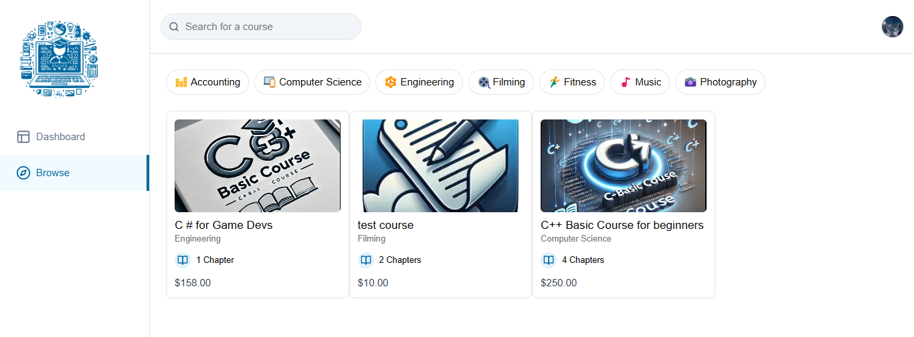

As of February 16, 2025, the repository for "Build an LMS Platform: Next.js 15, React, Stripe, Mux, Prisma, Tailwind, MySQL | Full Course 2025" is up-to-date with the latest technologies and best practices. Below are the key features, prerequisites, setup instructions, and available commands for the project:


## Key Features

- **Browse & Filter Courses**: Easily navigate and find courses of interest.
- **Purchase Courses using Stripe**: Secure payment processing for course enrollment.
- **Mark Chapters as Completed or Uncompleted**: Track learning progress effectively.
- **Progress Calculation of each Course**: Monitor overall course completion status.
- **Student Dashboard**: Personalized interface for learners to manage their courses.
- **Teacher Mode**: Instructors can create and manage their courses and content.
- **Create New Courses and Chapters**: User-friendly tools for content creation.
- **Easily Reorder Chapter Positions with Drag and Drop**: Intuitive interface for organizing course content.
- **Upload Thumbnails, Attachments, and Videos using UploadThing**: Simplified media management.
- **Video Processing using Mux**: Efficient handling and streaming of video content.
- **HLS Video Player using Mux**: High-quality video playback experience.
- **Rich Text Editor for Chapter Descriptions**: Enhanced content formatting options.
- **Authentication using Clerk**: Robust user authentication and management.
- **ORM using Prisma**: Seamless database interactions and migrations.
- **MySQL Database using PlanetScale**: Scalable and reliable database solution.
- **MongoDB Database for Production**: Cloud based database with free demo uses.



## Prerequisites

- **Node.js Version 18.x.x**: Ensure you have Node.js version 18 installed.

## Cloning the Repository

To clone the repository, execute the following command:

```bash
git clone https://github.com/dee-raj/dee-code-master-online.git
```

## Installing Packages

Navigate to the project directory and install the necessary packages:

```bash
npm install
```

## Setting Up the Environment Variables

Create a `.env` file in the root directory and add the following environment variables:

```env
NEXT_PUBLIC_CLERK_PUBLISHABLE_KEY=
CLERK_SECRET_KEY=
NEXT_PUBLIC_CLERK_SIGN_IN_URL=
NEXT_PUBLIC_CLERK_SIGN_UP_URL=
NEXT_PUBLIC_CLERK_AFTER_SIGN_IN_URL=
NEXT_PUBLIC_CLERK_AFTER_SIGN_UP_URL=

DATABASE_URL=

UPLOADTHING_SECRET=
UPLOADTHING_APP_ID=

MUX_TOKEN_ID=
MUX_TOKEN_SECRET=

STRIPE_API_KEY=
NEXT_PUBLIC_APP_URL=http://localhost:3000
STRIPE_WEBHOOK_SECRET=

NEXT_PUBLIC_TEACHER_ID=
```

Replace the placeholder values with your actual configuration details.
---

## Setting Up Prisma

Configure your MySQL database and initialize Prisma with the following commands:

```bash
npx prisma generate
npx prisma db push
npx prisma migrate reset
node ./scripts/seed.mjs
npx prisma studio
```

These commands will set up your database schema, apply migrations, seed initial data, and open Prisma Studio for database exploration.

## Starting the Application

To start the development server, run:

```bash
npm run dev
```

This will launch the application on `http://localhost:3000`.


## Setting Up Stripe CLI

Integrating Stripe CLI into your development workflow allows for efficient testing and management of Stripe functionalities. Here's how to set it up:

1. **Install Stripe CLI**:
   - refer to the [Stripe CLI documentation](https://stripe.com/docs/stripe-cli)

2. **Authenticate with Your Stripe Account**:
   - After installation, authenticate the CLI with your Stripe account:

     ```bash
     stripe login
     ```

   - This command will open a browser window prompting you to log in to your Stripe account and grant access to the CLI.

3. **Forward Webhooks to Your Local Server**:
   - To test webhook integrations locally, use the following command:

     ```bash
     stripe listen --forward-to localhost:3000/api/webhook
     ```

   - This sets up a listener that forwards Stripe events to your local webhook endpoint.


## Available Commands

You can execute the following commands using `npm run [command]`:

| Command | Description |
|---------|-------------|
| `dev`   | Starts a development instance of the app |

For more detailed information and updates, refer to the official Next.js 15 release notes.

By following these instructions, you should have the Learning Management System (LMS) platform up and running with the latest technologies and features. 